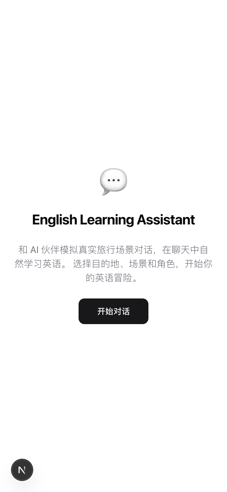
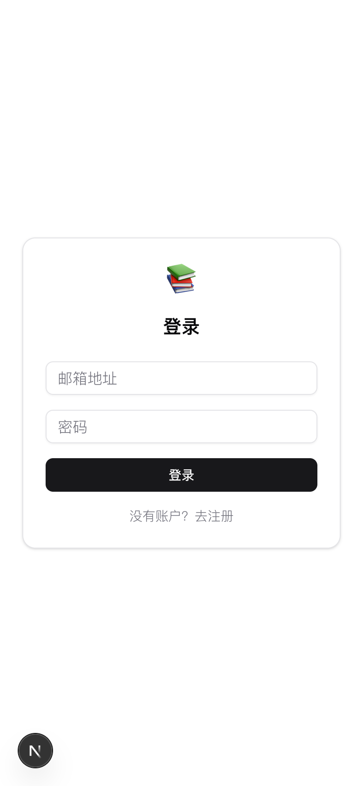
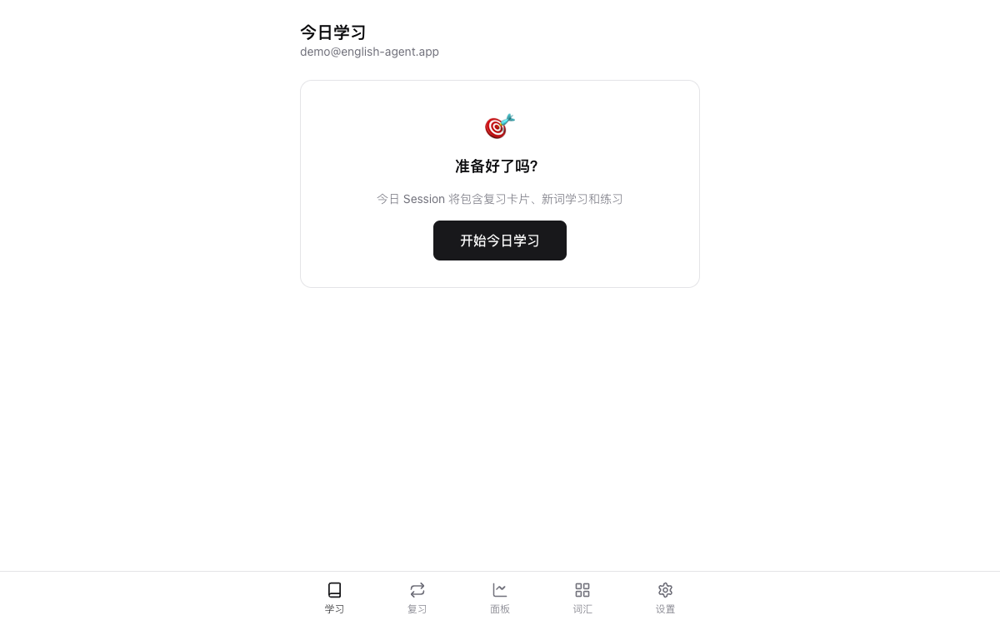
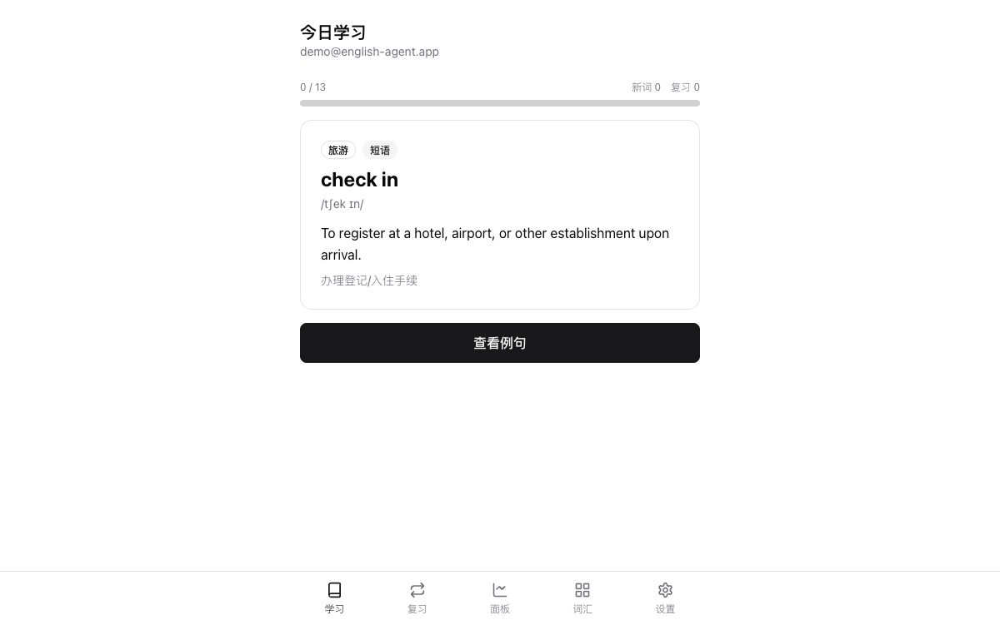
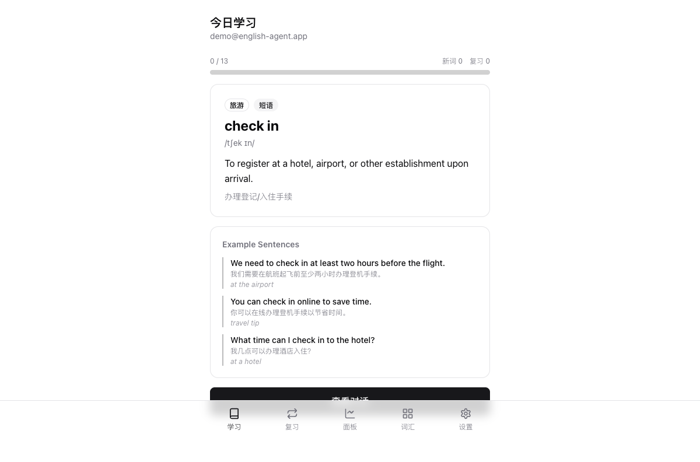
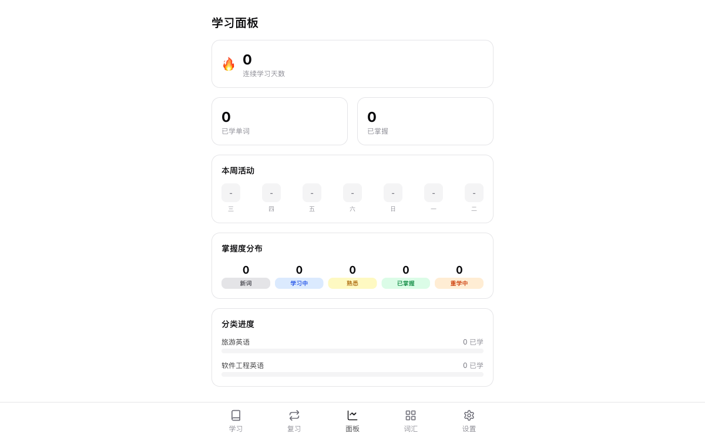
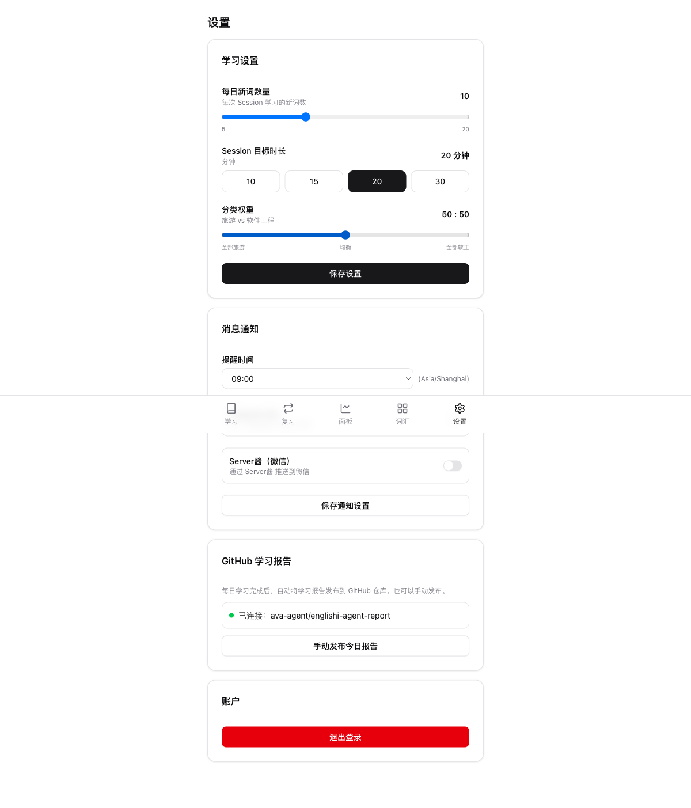

# English Learning Assistant

AI-driven personal English learning assistant focused on **Travel English** and **Software Engineering English**. Built with Next.js 16, Supabase, and GLM-4 (Zhipu AI), featuring FSRS spaced repetition for scientifically optimized vocabulary retention.

**Live Demo:** [https://english-agent.vercel.app](https://english-agent.vercel.app)

---

## Screenshots

| Landing Page | Login |
|:---:|:---:|
|  |  |

| Daily Learning | Vocabulary Card |
|:---:|:---:|
|  |  |

| Example Sentences | Dashboard |
|:---:|:---:|
|  |  |

| Settings & Notifications | Vocabulary Library |
|:---:|:---:|
|  |  |

---

## Features

### Core Learning
- **Daily Learning Sessions** - Personalized plans combining review cards, new vocabulary, and practice exercises
- **FSRS Spaced Repetition** - Powered by `ts-fsrs`, scientifically optimized review scheduling (Again / Hard / Good / Easy)
- **AI Content Generation** - GLM-4 generates example sentences, contextual dialogues, and fill-in-the-blank exercises
- **Dual Focus** - Travel English (airport, hotel, restaurant...) + Software Engineering English (API, architecture, testing...)
- **Vocabulary Library** - Browse all learned words with mastery status and review schedule

### Analytics & Tracking
- **Learning Dashboard** - Streak counter, weekly activity heatmap, mastery distribution, category progress
- **Session Stats** - Words learned, words reviewed, duration, completion rate
- **Daily Check-ins** - Streak tracking with streak freeze mechanism (1 free pass)

### Notifications
- **Telegram Bot** - Daily reminders and session completion notifications via Telegram
- **Server Chan (WeChat)** - Push notifications to WeChat via Server Chan service
- **Web Push** - Browser native push notifications
- **Configurable Schedule** - Set preferred reminder time per timezone

### Automation
- **Daily Reminder** (1:00 AM UTC) - Multi-channel push with streak and due card count
- **Daily Report** (4:00 PM UTC) - Auto-generate and commit Markdown learning report to GitHub
- **Streak Check** (5:00 PM UTC) - Auto-apply streak freeze if user missed a day

### GitHub Integration
- Auto-publish daily learning reports to a GitHub repository
- Markdown format with session summary, words learned, mastery progress
- File structure: `reports/YYYY/MM/YYYY-MM-DD.md`
- Manual publish via settings page

---

## Tech Stack

| Layer | Technology |
|---|---|
| Framework | Next.js 16 (App Router, Server Components, Server Actions) |
| Language | TypeScript 5 |
| UI | Tailwind CSS 4 + Radix UI + shadcn/ui |
| Database | PostgreSQL 17 (Supabase) with RLS |
| Auth | Supabase Auth (Email + Password, PKCE flow) |
| AI | GLM-4 Plus (Zhipu AI) via OpenAI-compatible SDK |
| SRS | ts-fsrs v5.2 (Free Spaced Repetition Scheduler) |
| Notifications | Telegram Bot API, Server Chan API, Web Push |
| GitHub | Octokit REST API |
| Deployment | Vercel (with Cron Jobs) |

---

## Project Structure

```
src/
├── app/
│   ├── (authenticated)/        # Protected routes
│   │   ├── dashboard/          # Learning analytics
│   │   ├── learn/              # Daily learning session
│   │   ├── review/             # Quick review mode
│   │   ├── vocabulary/         # Vocabulary library
│   │   └── settings/           # User preferences
│   ├── api/cron/               # Scheduled jobs
│   │   ├── daily-reminder/     # Push notifications
│   │   ├── daily-report/       # GitHub report
│   │   └── streak-check/       # Streak freeze
│   ├── actions/                # Server actions
│   │   ├── session.ts          # Session management
│   │   ├── review.ts           # SRS review processing
│   │   ├── settings.ts         # User settings
│   │   ├── notification.ts     # Test notifications
│   │   └── report.ts           # GitHub report publishing
│   ├── auth/confirm/           # Email confirmation handler
│   └── login/                  # Authentication page
├── components/
│   ├── session/                # Learning session UI
│   │   ├── session-container   # Session orchestrator
│   │   ├── learn-card          # New word display
│   │   ├── review-card         # SRS flashcard
│   │   ├── practice-card       # Fill-in-the-blank
│   │   └── session-summary     # Completion screen
│   ├── vocabulary/             # Vocabulary list UI
│   └── ui/                     # shadcn components
├── lib/
│   ├── srs.ts                  # FSRS algorithm wrapper
│   ├── llm.ts                  # GLM-4 API client
│   ├── github.ts               # GitHub commit logic
│   ├── session-builder.ts      # Session plan generator
│   ├── report-generator.ts     # Report Markdown builder
│   ├── notifications/          # Notification dispatcher
│   │   ├── index.ts            # Unified multi-channel sender
│   │   ├── telegram.ts         # Telegram Bot API
│   │   ├── serverchan.ts       # Server Chan (WeChat)
│   │   └── messages.ts         # Message templates
│   └── supabase/               # Database clients
└── middleware.ts               # Auth route protection
```

---

## Database Schema

6 tables with Row-Level Security:

- **profiles** - User settings, notification preferences, streak freeze
- **vocabulary** - Master word corpus (travel + software engineering)
- **user_cards** - Per-user SRS card state (due, stability, difficulty, reps, lapses)
- **sessions** - Learning session records with plan and progress
- **review_logs** - Immutable review history for analytics
- **daily_checkins** - Daily streak tracking

3 PostgreSQL functions:
- `get_mastery_distribution(user_id)` - Word count by mastery level
- `get_category_progress(user_id)` - Progress per category
- `get_current_streak(user_id)` - Consecutive learning days

---

## Getting Started

### Prerequisites

- Node.js 18+
- Supabase project ([supabase.com](https://supabase.com))
- Zhipu AI API key ([open.bigmodel.cn](https://open.bigmodel.cn))

### Installation

```bash
git clone https://github.com/ava-agent/english-agent.git
cd english-agent
npm install
```

### Environment Variables

Copy `.env.example` to `.env.local` and fill in the values:

```bash
cp .env.example .env.local
```

| Variable | Required | Description |
|---|:---:|---|
| `NEXT_PUBLIC_SUPABASE_URL` | Yes | Supabase project URL |
| `NEXT_PUBLIC_SUPABASE_ANON_KEY` | Yes | Supabase anonymous key |
| `SUPABASE_SERVICE_ROLE_KEY` | Yes | Supabase service role key (server-side) |
| `ZHIPU_API_KEY` | Yes | Zhipu AI API key for GLM-4 |
| `ZHIPU_BASE_URL` | Yes | `https://open.bigmodel.cn/api/paas/v4` |
| `CRON_SECRET` | Yes | Secret for Vercel cron job auth |
| `GITHUB_TOKEN` | No | GitHub PAT for report publishing |
| `GITHUB_REPO_OWNER` | No | GitHub repo owner for reports |
| `GITHUB_REPO_NAME` | No | GitHub repo name for reports |
| `TELEGRAM_BOT_TOKEN` | No | Telegram bot token from @BotFather |
| `NEXT_PUBLIC_APP_URL` | No | Production URL for notifications |

### Database Setup

Apply migrations via Supabase CLI:

```bash
npx supabase db push
```

Or apply the migration files in `supabase/migrations/` manually via the Supabase SQL editor.

### Development

```bash
npm run dev
```

Open [http://localhost:3000](http://localhost:3000).

### Deployment

Deploy to Vercel:

```bash
npx vercel --prod
```

The `vercel.json` configures 3 cron jobs automatically:

| Cron | Schedule | Description |
|---|---|---|
| `/api/cron/daily-reminder` | `0 1 * * *` | Send daily learning reminders |
| `/api/cron/daily-report` | `0 16 * * *` | Publish report to GitHub |
| `/api/cron/streak-check` | `0 17 * * *` | Auto-apply streak freeze |

---

## Notification Setup

### Telegram Bot

1. Message [@BotFather](https://t.me/BotFather) on Telegram, send `/newbot`
2. Copy the bot token, set as `TELEGRAM_BOT_TOKEN` on Vercel
3. In the app settings page, enable Telegram and enter your Chat ID

### Server Chan (WeChat)

1. Register at [sct.ftqq.com](https://sct.ftqq.com)
2. Get your SendKey
3. In the app settings page, enable Server Chan and enter your SendKey

---

## FSRS Spaced Repetition

The app uses the **Free Spaced Repetition Scheduler** algorithm:

| Rating | Meaning | Effect |
|---|---|---|
| Again (1) | Forgot | Card stays in learning/relearning |
| Hard (2) | Difficult | Extends review interval slightly |
| Good (3) | Correct | Normal interval progression |
| Easy (4) | Effortless | Fast-tracks to longer intervals |

Card mastery levels:
- **New** - Never reviewed
- **Learning** - In initial learning phase
- **Familiar** - In review with stability <= 30
- **Mastered** - In review with stability > 30
- **Relearning** - Failed review, re-learning

---

## License

MIT
