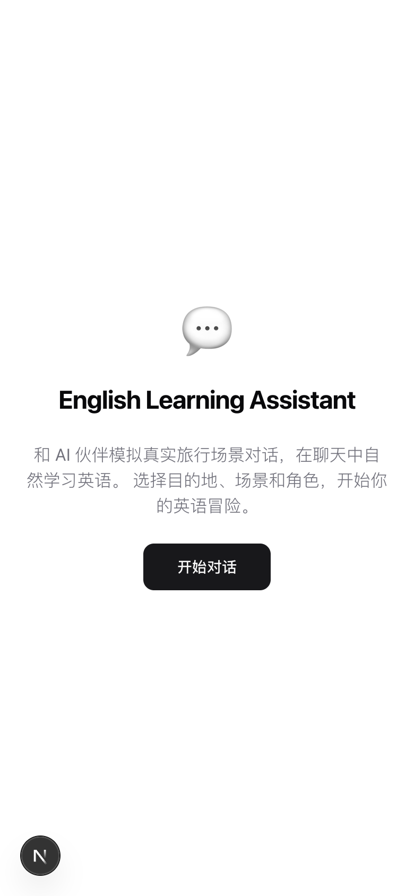
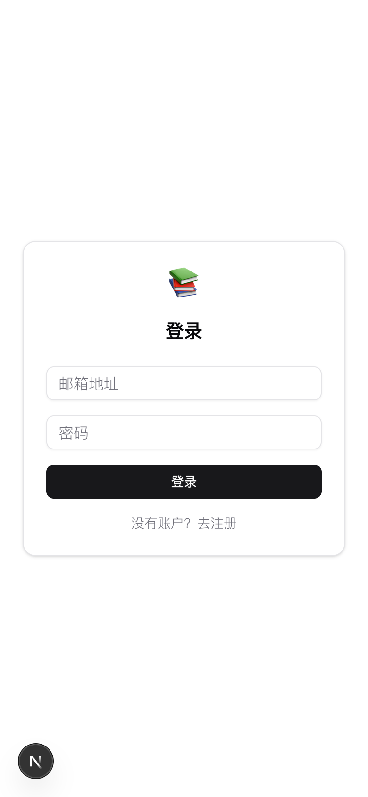
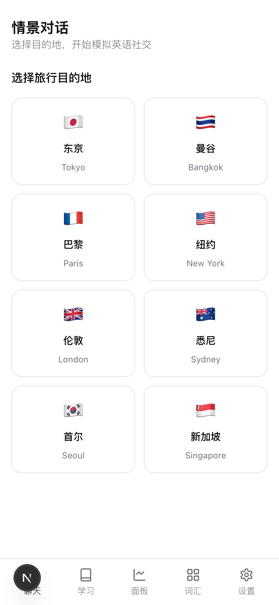
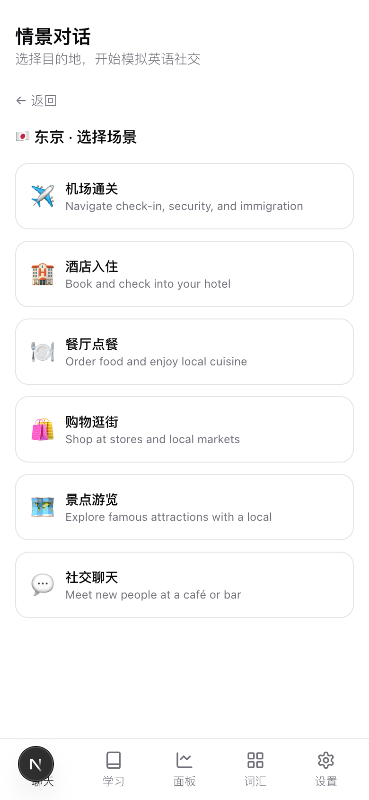
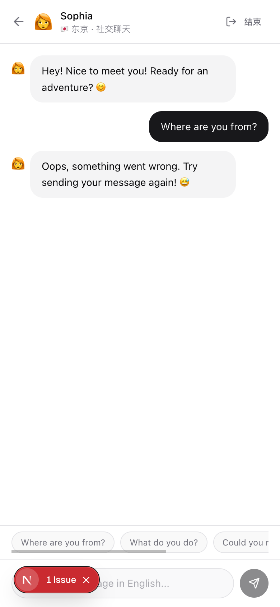
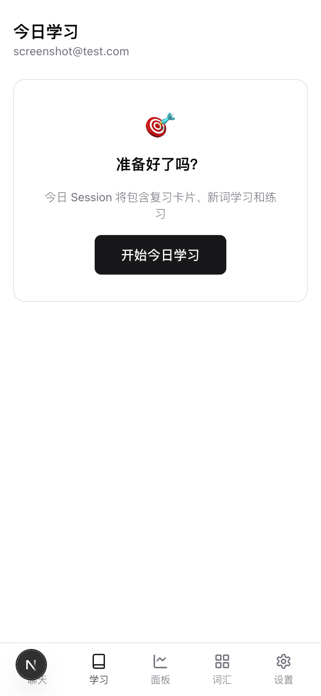
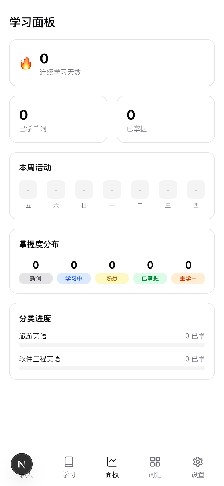
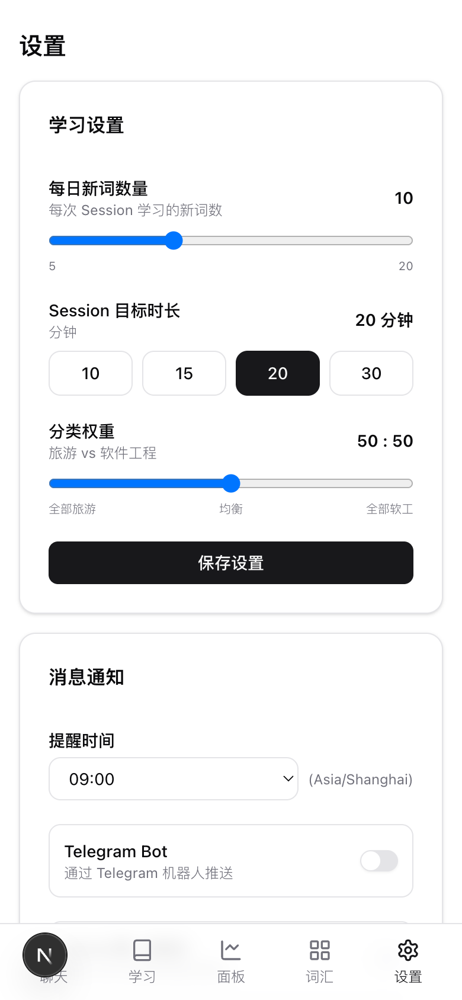

# English Learning Assistant

AI 驱动的英语学习助手，以**情景对话**为核心，通过模拟真实旅行场景与 AI 角色聊天，在自然交流中学习英语。

**在线体验:** [https://english.rxcloud.group](https://english.rxcloud.group)

---

## 截图

| 首页 | 登录 |
|:---:|:---:|
|  |  |

| 选择目的地 | 选择场景 |
|:---:|:---:|
|  |  |

| 选择角色 | 对话界面 |
|:---:|:---:|
|  |  |

| 每日学习 | 学习面板 |
|:---:|:---:|
|  |  |

| 词汇库 | 设置 |
|:---:|:---:|
|  |  |

---

## 核心功能

### 情景对话 (主打功能)
- **8 个旅行目的地** - 东京、曼谷、巴黎、纽约、伦敦、悉尼、首尔、新加坡
- **6 种场景** - 机场通关、酒店入住、餐厅点餐、购物逛街、景点游览、社交聊天
- **3 位 AI 角色** - Sophia (美国旅行博主)、Emma (英国英语老师)、Mia (澳洲背包客)，各有独特性格和说话风格
- **实时流式对话** - AI 角色保持人设，自然引入实用词汇并用 **粗体** 标记
- **快捷回复** - 根据场景提供常用短语建议，降低输入门槛
- **自动词汇提取** - 对话结束后自动提取新词，生成定义和中文翻译，纳入 SRS 复习

### 每日学习
- **个性化学习计划** - 结合复习卡片、新词汇和练习题
- **FSRS 间隔重复** - 基于 `ts-fsrs`，科学安排复习时间 (Again / Hard / Good / Easy)
- **AI 内容生成** - GLM-4 生成例句、情景对话和填空练习
- **双主题** - 旅游英语 + 软件工程英语

### 数据分析
- **学习面板** - 连续打卡天数、每周活跃度、掌握度分布、分类进度
- **词汇库** - 浏览所有已学词汇，查看掌握状态和复习计划

### 通知推送
- **Telegram Bot** - 每日提醒和学习完成通知
- **Server 酱 (微信)** - 通过 Server 酱推送到微信
- **Web Push** - 浏览器原生推送通知
- **可配置时间** - 按时区设置每日提醒时间

### 自动化
- **每日提醒** (UTC 1:00) - 多渠道推送，包含连续天数和待复习数量
- **每日报告** (UTC 16:00) - 自动生成 Markdown 学习报告并提交到 GitHub
- **打卡检查** (UTC 17:00) - 自动使用打卡冻结保护连续天数

---

## 技术栈

| 层级 | 技术 |
|---|---|
| 框架 | Next.js 16 (App Router, Server Components, Server Actions) |
| 语言 | TypeScript 5 |
| UI | Tailwind CSS 4 + Radix UI + shadcn/ui |
| 数据库 | PostgreSQL 17 (Supabase) + RLS 行级安全 |
| 认证 | Supabase Auth (邮箱密码, PKCE 流程) |
| AI | GLM-4 Plus (智谱 AI) via OpenAI 兼容 SDK |
| SRS | ts-fsrs v5.2 (间隔重复算法) |
| 通知 | Telegram Bot API, Server 酱 API, Web Push |
| GitHub | Octokit REST API |
| 部署 | Vercel (含 Cron Jobs) |
| 输入校验 | Zod |

---

## 项目结构

```
src/
├── app/
│   ├── (authenticated)/        # 需认证路由
│   │   ├── chat/               # 情景对话 (主功能)
│   │   │   ├── [id]/           # 对话界面
│   │   │   ├── client.tsx      # 目的地/场景/角色选择器
│   │   │   └── page.tsx        # 对话列表
│   │   ├── learn/              # 每日学习
│   │   ├── dashboard/          # 学习面板
│   │   ├── vocabulary/         # 词汇库
│   │   └── settings/           # 用户设置
│   ├── api/
│   │   ├── chat/               # 流式对话 API
│   │   └── cron/               # 定时任务
│   ├── actions/                # Server Actions
│   └── login/                  # 登录页
├── components/
│   ├── chat/                   # 对话组件
│   │   ├── chat-view.tsx       # 对话主视图 (流式消息、快捷回复)
│   │   ├── chat-bubble.tsx     # 消息气泡 (词汇高亮、点击查释义)
│   │   └── chat-summary.tsx    # 对话总结 (词汇列表、统计)
│   ├── session/                # 学习会话组件
│   └── ui/                     # shadcn 组件
├── lib/
│   ├── chat-ai.ts              # 对话 AI (系统提示词、流式响应、词汇提取)
│   ├── chat-constants.ts       # 目的地、场景、角色定义
│   ├── srs.ts                  # FSRS 算法封装
│   ├── llm.ts                  # GLM-4 API 客户端
│   ├── validation.ts           # Zod 输入校验
│   ├── github.ts               # GitHub 提交逻辑
│   ├── notifications/          # 通知分发
│   └── supabase/               # 数据库客户端
└── middleware.ts               # 路由保护
```

---

## 数据库

8 张表，全部启用 Row-Level Security:

- **profiles** - 用户设置、通知偏好、打卡冻结
- **vocabulary** - 词汇语料库 (旅游 + 软件工程)
- **user_cards** - 用户 SRS 卡片状态 (到期时间、稳定性、难度、重复次数)
- **sessions** - 学习会话记录
- **review_logs** - 不可变的复习历史
- **daily_checkins** - 每日打卡记录
- **chat_conversations** - 对话会话 (角色、目的地、场景、状态、已学词汇)
- **chat_conversation_messages** - 对话消息 (角色、内容、元数据)

3 个 PostgreSQL 函数:
- `get_mastery_distribution(user_id)` - 按掌握度统计词汇数量
- `get_category_progress(user_id)` - 按分类统计学习进度
- `get_current_streak(user_id)` - 计算连续学习天数

---

## 快速开始

### 前置条件

- Node.js 18+
- Supabase 项目 ([supabase.com](https://supabase.com))
- 智谱 AI API 密钥 ([open.bigmodel.cn](https://open.bigmodel.cn))

### 安装

```bash
git clone https://github.com/ava-agent/english-agent.git
cd english-agent
npm install
```

### 环境变量

复制 `.env.example` 到 `.env.local` 并填入:

```bash
cp .env.example .env.local
```

| 变量 | 必填 | 说明 |
|---|:---:|---|
| `NEXT_PUBLIC_SUPABASE_URL` | 是 | Supabase 项目 URL |
| `NEXT_PUBLIC_SUPABASE_ANON_KEY` | 是 | Supabase 匿名密钥 |
| `SUPABASE_SERVICE_ROLE_KEY` | 是 | Supabase 服务角色密钥 |
| `ZHIPU_API_KEY` | 是 | 智谱 AI API 密钥 |
| `ZHIPU_BASE_URL` | 是 | `https://open.bigmodel.cn/api/paas/v4` |
| `CRON_SECRET` | 是 | Vercel 定时任务鉴权密钥 |
| `GITHUB_TOKEN` | 否 | GitHub PAT (报告发布) |
| `GITHUB_REPO_OWNER` | 否 | GitHub 仓库所有者 |
| `GITHUB_REPO_NAME` | 否 | GitHub 仓库名称 |
| `TELEGRAM_BOT_TOKEN` | 否 | Telegram Bot Token |
| `NEXT_PUBLIC_APP_URL` | 否 | 生产环境 URL |

### 数据库初始化

通过 Supabase CLI 应用迁移:

```bash
npx supabase db push
```

或在 Supabase SQL 编辑器中手动执行 `supabase/migrations/` 下的迁移文件。

### 本地开发

```bash
npm run dev
```

打开 [http://localhost:3000](http://localhost:3000)。

### 部署

部署到 Vercel:

```bash
npx vercel --prod
```

`vercel.json` 自动配置 3 个定时任务:

| 定时任务 | 时间 | 说明 |
|---|---|---|
| `/api/cron/daily-reminder` | `0 1 * * *` | 发送每日学习提醒 |
| `/api/cron/daily-report` | `0 16 * * *` | 发布学习报告到 GitHub |
| `/api/cron/streak-check` | `0 17 * * *` | 自动使用打卡冻结 |

---

## 对话系统架构

```
用户选择 目的地 → 场景 → 角色
         ↓
  startConversation()
  → 创建 chat_conversations 记录
  → generateGreeting() 生成 AI 开场白
         ↓
  用户发送消息 → POST /api/chat
  → Zod 校验输入
  → 保存用户消息到 DB
  → buildSystemPrompt() 构建角色提示词
  → streamChatResponse() 流式生成回复
  → stream.tee() 分流: 客户端展示 + DB 保存
         ↓
  用户结束对话 → endConversation()
  → extractVocabulary() 提取 **粗体** 词汇
  → LLM 生成定义和翻译
  → 词汇入库 + 创建 SRS 卡片
```

---

## License

MIT
